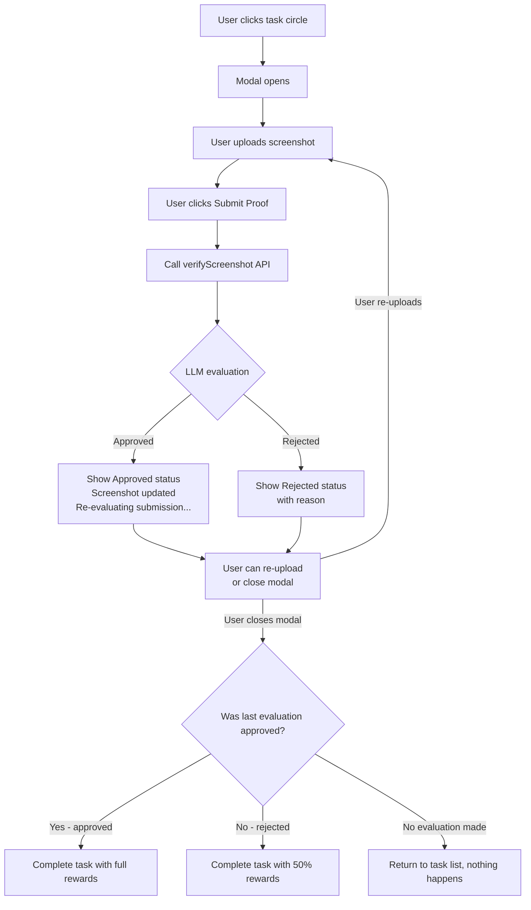
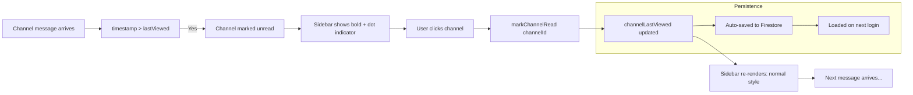
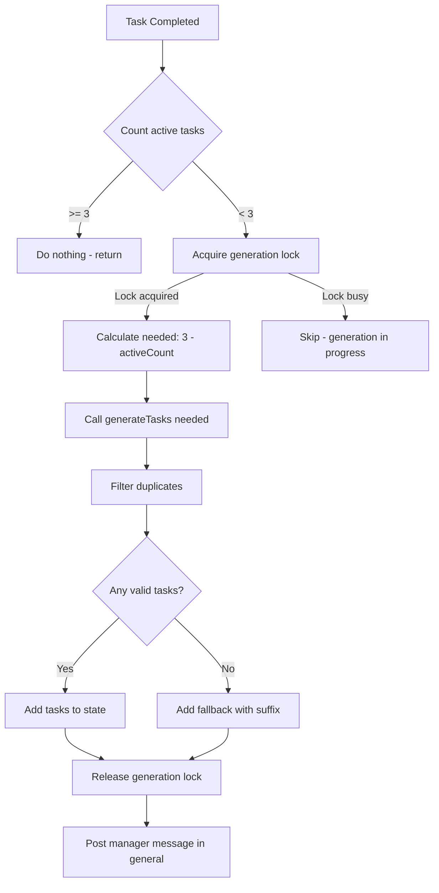

# Employment Simulator — Core Gameplay & UX Improvement Plan

## Overview

This plan addresses 4 interconnected issues in the Slack-style AI workplace simulator: unlimited screenshot submissions, unread channel indicators, task generation logic, and system consistency. Each fix is detailed below with implementation steps, files to modify, and Mermaid diagrams where applicable.

---

## Fix 1: Unlimited Screenshot Submission Attempts

### Root Cause Analysis

Currently, [`completeTaskWithProof`](src/context/GameContext.jsx:809) couples screenshot verification with task completion in a single irreversible step:

1. User uploads image → clicks "Submit Proof"
2. [`approveScreenshot()`](src/systems/screenshotApproval.js:26) runs LLM evaluation
3. [`completeTask()`](src/context/GameContext.jsx:713) is called immediately, permanently marking task as completed
4. [`TaskVerificationModal`](src/components/TaskVerificationModal.jsx:17) auto-closes after 4 seconds
5. No retry mechanism exists — user cannot re-attempt

The [`TaskVerificationModal`](src/components/TaskVerificationModal.jsx:6) also destroys its state after approve/reject, providing no path to re-upload.

### Solution Architecture



### Changes Required

#### A. [`src/context/GameContext.jsx`](src/context/GameContext.jsx)

1. **Add new state field**: `pendingVerifications: {}` — a map of `taskId -> { status, approvalResult, imageData }` stored in state (not context, just local state)

2. **New function**: `verifyScreenshot(taskId, base64Image)` — pure verification WITHOUT completing the task:
   - Calls [`approveScreenshot()`](src/systems/screenshotApproval.js:26)
   - Stores result in `pendingVerifications` map
   - Does NOT call `completeTask()`
   - Returns the approval result

3. **Modify `completeTaskWithProof`** — change to use the latest pending verification result:
   ```js
   const completeTaskWithProof = useCallback(async (taskId) => {
       const pending = pendingVerifications[taskId];
       const multiplier = pending?.approvalResult?.approved ? 1.0 : 0.5;
       completeTask(taskId, multiplier);
       // ... rest of the completion logic
   }, [pendingVerifications]);
   ```

4. **Add state cleanup**: When `completeTaskWithProof` is called, clear the pending verification for that task.

#### B. [`src/components/TaskVerificationModal.jsx`](src/components/TaskVerificationModal.jsx)

1. **Remove auto-close behavior** (lines 17-28): Delete the `useEffect` that auto-closes after 4 seconds on approve/reject. Instead, keep the modal open so user can re-upload.

2. **Add retry UI**: After showing a result (approved/rejected), continue showing the file preview and "Submit Proof" / "Upload Another" buttons so the user can:
   - Upload a different screenshot → triggers new evaluation
   - Upload the same/similar screenshot → triggers re-evaluation

3. **Update status feedback text**:
   - "Screenshot updated" when new file is selected
   - "Re-evaluating submission..." during LLM check
   - "New result: Approved / Not approved" after evaluation

4. **Change submit behavior**: `onVerify` should now call `verifyScreenshot` (which doesn't complete the task), not `completeTaskWithProof`.

5. **Add explicit "Complete Task" button** that only becomes available after a successful verification.

#### C. [`src/components/TaskBoard.jsx`](src/components/TaskBoard.jsx) and [`src/components/TaskList.jsx`](src/components/TaskList.jsx)

- Pass the new `verifyScreenshot` function alongside `completeTaskWithProof`
- Update modal props accordingly

#### D. [`src/components/tasks/TaskBoard.jsx`](src/components/tasks/TaskBoard.jsx)

- Line 151: Change `onVerify={completeTaskWithProof}` → `onVerify={verifyScreenshot}`
- Add `onCompleteWithProof={completeTaskWithProof}` for the finalize action

---

## Fix 2: Unread Channel Indicators (Slack-style)

### Root Cause Analysis

1. [`markChannelRead`](src/context/GameContext.jsx:993) is defined in GameContext but **never called** anywhere in the app
2. [`Sidebar.jsx`](src/components/layout/Sidebar.jsx:38) has a **hardcoded placeholder** `getUnreadCount` that returns `0`
3. [`getUnreadCount`](src/context/GameContext.jsx:1003) and [`isChannelUnread`](src/context/GameContext.jsx:1010) exist in context but are not consumed in the sidebar
4. `channelLastViewed` (state field) is properly persisted to Firestore (line 175)
5. No visual styling exists for unread state

### Solution Architecture



### Changes Required

#### A. [`src/components/layout/Sidebar.jsx`](src/components/layout/Sidebar.jsx)

1. **Import** `markChannelRead`, `getUnreadCount`, `isChannelUnread` from `useGame()` (line 11)

2. **Remove placeholder function** (lines 38-40): Delete the local `getUnreadCount` that returns 0

3. **Wire `handleChannelClick`** to call `markChannelRead`:
   ```js
   const handleChannelClick = (channelId) => {
       markChannelRead(channelId);
       setActiveChannel(channelId);
       onNavigate('chat');
   };
   ```

4. **Update channel rendering** — add unread styling:
   - For regular channels (line 120-133): Check `isChannelUnread(ch.id)` and apply:
     - `font-bold` + `text-white` (instead of `text-gray-400`) when unread
     - A dot/badge indicator (e.g., `bg-blue-500 w-2 h-2 rounded-full`) before the channel name
     - Optionally show unread count badge
   - For DM channels (line 140-156): Same treatment

5. **Styling specifics**:
   ```jsx
   // Unread channel style override
   const unreadClass = isChannelUnread(ch.id)
       ? 'text-white font-semibold'
       : 'text-gray-400 hover:text-gray-200';
   
   // Unread dot indicator
   {isChannelUnread(ch.id) && (
       <div className="w-2 h-2 rounded-full bg-blue-500 shrink-0" />
   )}
   ```

#### B. [`src/components/chat/ChatView.jsx`](src/components/chat/ChatView.jsx)

1. **Call `markChannelRead`** when the chat view mounts or `activeChannel` changes:
   ```jsx
   const { activeChannel, messages, sendMessage, typingCharacter, markChannelRead } = useGame();

   useEffect(() => {
       if (activeChannel) {
           markChannelRead(activeChannel);
       }
   }, [activeChannel, markChannelRead]);
   ```

#### C. [`src/components/tasks/TaskBoard.jsx`](src/components/tasks/TaskBoard.jsx)

- No change needed (task view doesn't affect channel unread state)

#### D. Edge Case Handlers

1. **Rapid channel switching**: [`markChannelRead`](src/context/GameContext.jsx:993) uses simple `setState` with `Date.now()` — this is synchronous and instantaneous, so rapid switching is safe

2. **Delayed message sync**: Messages arrive via `addMessage` which updates state immediately. The `getUnreadCount` calculation (line 1003-1008) filters `m.timestamp > lastViewed`, so delayed messages that arrive after channel is marked read will correctly show as unread

3. **Stale cache values**: Since `channelLastViewed` is persisted to Firestore and loaded on startup (line 137), values survive refreshes

4. **Incorrect timestamp initialization**: Default `lastViewed = 0` in `getUnreadCount` (line 1006) means all existing messages will show as unread until the channel is first clicked. This is acceptable initial behavior. To improve: initialize `channelLastViewed` for each channel to the timestamp of the first message load.

---

## Fix 3: Task Generation Logic Fix (Critical)

### Root Cause Analysis

The codebase has **two parallel systems**:

| System | Location | Task Generation Logic |
|--------|----------|----------------------|
| **Old** (Legacy) | [`src/hooks/useSimulator.js`](src/hooks/useSimulator.js) | Timer-based check every mount, 120s cooldown, generates 1 task at a time |
| **New** (Current) | [`src/context/GameContext.jsx`](src/context/GameContext.jsx) | [`ensureMinimumTasks()`](src/context/GameContext.jsx:734) called after task completion |

The new system in GameContext is the one we need to fix. Issues found:

1. **Race condition**: [`ensureMinimumTasks`](src/context/GameContext.jsx:734) returns `prev` immediately, then does async generation via `generateTasks()`. If `ensureMinimumTasks` is called multiple times in quick succession (e.g., completing 2 tasks rapidly), multiple async chains run concurrently, each possibly adding tasks.

2. **No generation lock**: The function uses `generateTasks()` without locking, so concurrent calls can both generate and add tasks, exceeding the minimum.

3. **Potential double-triggering**: Both [`completeTaskWithProof`](src/context/GameContext.jsx:809) and [`completeTaskWithoutProof`](src/context/GameContext.jsx:920) call `ensureMinimumTasks()`, and there's nothing preventing both from running simultaneously if a user completes tasks quickly.

### Solution Architecture



### Changes Required

#### A. [`src/context/GameContext.jsx`](src/context/GameContext.jsx)

1. **Add ref for generation lock** alongside existing `isGeneratingRef`:
   ```js
   const taskGenerationLockRef = useRef(false);
   ```

2. **Rewrite `ensureMinimumTasks`** with proper locking and deduplication:
   ```js
   const ensureMinimumTasks = useCallback(() => {
       // Use ref-based lock to prevent concurrent generation
       if (taskGenerationLockRef.current) return;
       
       const activeTasks = state.tasks.filter(t => !t.completed);
       const count = activeTasks.length;
       if (count >= 3) return;
       
       taskGenerationLockRef.current = true;
       const needed = 3 - count;
       
       // ... async generation with lock release in finally block
   }, [state.tasks, state.userGoal, state.projectContext, addMessage]);
   ```

3. **Fix the async state access pattern**: Current code accesses `setState` inside the `.then()` of `generateTasks`, which can lead to stale closures. Use a functional updater pattern.

4. **Remove the old legacy code path**: The `completeTaskWithProof` (line 809) calls `ensureMinimumTasks()` at line 915. Ensure this is the only place that triggers top-up.

5. **Verify `clockIn` function**: At clock-in (line 409), after the first task is generated, `ensureMinimumTasks()` must be called to top up to 3 tasks. Currently, it only generates 1 task. Add `ensureMinimumTasks()` call after the initial task is generated.

#### B. [`src/systems/taskGenerator.js`](src/systems/taskGenerator.js)

1. **No major changes needed** — the `generateTasks` function already accepts a count parameter and works correctly.

2. **Optional improvement**: Add a `variation` parameter to help generate more diverse tasks when asked for small counts (1-2).

#### C. Logic Verification Against Requirements

| Scenario | Current Behavior | Required Behavior | Fix |
|----------|-----------------|-------------------|-----|
| 0 active tasks | Generates 1 on clock-in, then top-up | Generate 3 immediately | Call `ensureMinimumTasks()` after clock-in |
| 1 active task | Generates 2 (3-1=2) | Generate 2 | Already correct in `ensureMinimumTasks`, just needs lock fix |
| 2 active tasks | Generates 1 (3-2=1) | Generate 1 | Already correct |
| 3+ active tasks | Might generate more due to race conditions | Generate 0 | Lock fixes prevent this |
| Task completed | Currently calls `ensureMinimumTasks()` | Top-up by 1 | Correct, just needs locking |

---

## Fix 4: System Consistency & Race Condition Prevention

### Cross-Cutting Concerns

All three fixes above share a common need for consistency. This section covers the systemic fixes.

### Changes Required

#### A. [`src/context/GameContext.jsx`](src/context/GameContext.jsx) — Shared State Locking

1. **Centralized generation lock**: Use a single `Ref` for all async generation:
   ```js
   const generationLockRef = useRef({
       task: false,     // task generation
       coworker: false, // AI coworker responses
       screenshot: false // screenshot verification
   });
   ```

2. **Ensure `ensureMinimumTasks` is called exactly once per completion event**: Move the call into a `useEffect` that watches `tasks` changes rather than calling it imperatively in each completion function. This provides React's batching guarantees.

3. **Debounce rapid completions**: If a user completes multiple tasks in under 1 second, debounce the `ensureMinimumTasks` call to avoid multiple generation triggers.

#### B. [`src/systems/taskGenerator.js`](src/systems/taskGenerator.js)

1. **Add stricter duplicate prevention**: The current code checks against `currentActiveTitles` but this can be stale. Add a unique context hash to ensure the LLM doesn't return duplicates of recently generated tasks.

#### C. State Synchronization

1. **Verify message state is consistent** when tasks are concurrently generated and messages are posted. The `addMessage` call inside `ensureMinimumTasks` (line 794) uses `setTimeout`, which is fragile. Replace with a direct dispatch pattern.

---

## Files Modified Summary

| File | Fix 1 | Fix 2 | Fix 3 | Fix 4 |
|------|-------|-------|-------|-------|
| [`src/context/GameContext.jsx`](src/context/GameContext.jsx) | ✅ New `verifyScreenshot`, modify `completeTaskWithProof` | ✅ Already has `markChannelRead` (just needs calling) | ✅ Rewrite `ensureMinimumTasks`, add lock | ✅ Add generation lock refs |
| [`src/components/TaskVerificationModal.jsx`](src/components/TaskVerificationModal.jsx) | ✅ Remove auto-close, add retry, change submit flow | | | |
| [`src/components/layout/Sidebar.jsx`](src/components/layout/Sidebar.jsx) | | ✅ Wire unread indicators, remove placeholder | | |
| [`src/components/chat/ChatView.jsx`](src/components/chat/ChatView.jsx) | | ✅ Call `markChannelRead` on mount/channel change | | |
| [`src/components/TaskBoard.jsx`](src/components/TaskBoard.jsx) | ✅ Update modal props | | | |
| [`src/components/TaskList.jsx`](src/components/TaskList.jsx) | ✅ Update modal props | | | |
| [`src/systems/taskGenerator.js`](src/systems/taskGenerator.js) | | | ✅ Optional: better variation | ✅ Optional: stricter duplicates |

---

## Implementation Order

1. **Fix 3 first** (Task Generation) — foundational, affects reward loops and game feel
2. **Fix 1** (Screenshot Submissions) — depends on Fix 3 being stable
3. **Fix 2** (Unread Indicators) — independent, UI-only
4. **Fix 4** (System Consistency) — final pass to lock everything together

---

## Testing Checklist

### Fix 1 — Screenshot
- [ ] Submit screenshot → verify LLM evaluation runs
- [ ] Submit a second screenshot for same task → see "Screenshot updated" + re-evaluation
- [ ] Close modal after rejection → task remains active
- [ ] Close modal after approval → task is completed with full rewards
- [ ] Verify "Screenshot updated" / "Re-evaluating submission..." / "New result" messages appear

### Fix 2 — Unread Indicators
- [ ] Channel with new messages shows bold + dot indicator
- [ ] Clicking channel clears unread state immediately
- [ ] Unread state persists across page refresh (Firestore)
- [ ] Rapid channel switching works correctly
- [ ] DM channels also show unread indicators correctly
- [ ] Messages arriving while viewing a channel don't trigger unread state

### Fix 3 — Task Generation
- [ ] Clock in → exactly 3 tasks generated
- [ ] Complete 1 task → 1 new task generated (total stays at 3)
- [ ] Complete all tasks → 3 new tasks generated
- [ ] No duplicate tasks generated
- [ ] No extra generation when 3+ tasks are active
- [ ] Rapid task completion doesn't over-generate

### Fix 4 — Consistency
- [ ] No console errors during task generation
- [ ] No duplicate tasks in state after rapid completions
- [ ] Messages posted correctly for each new task batch
- [ ] No race conditions visible in React DevTools
